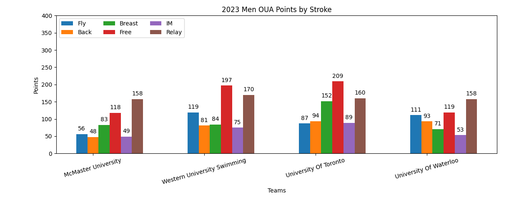
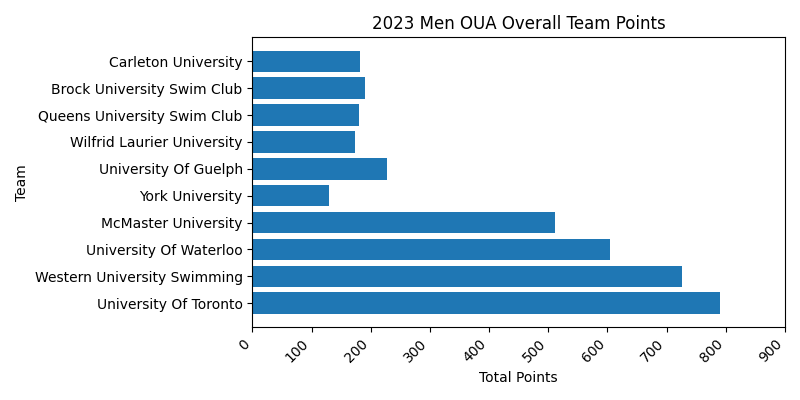
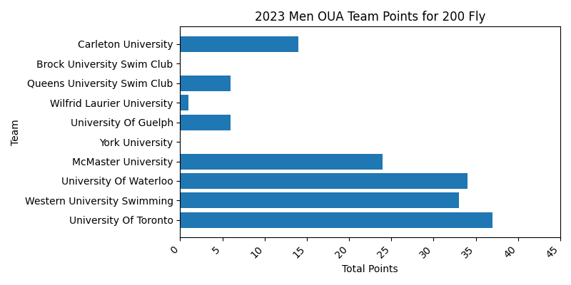
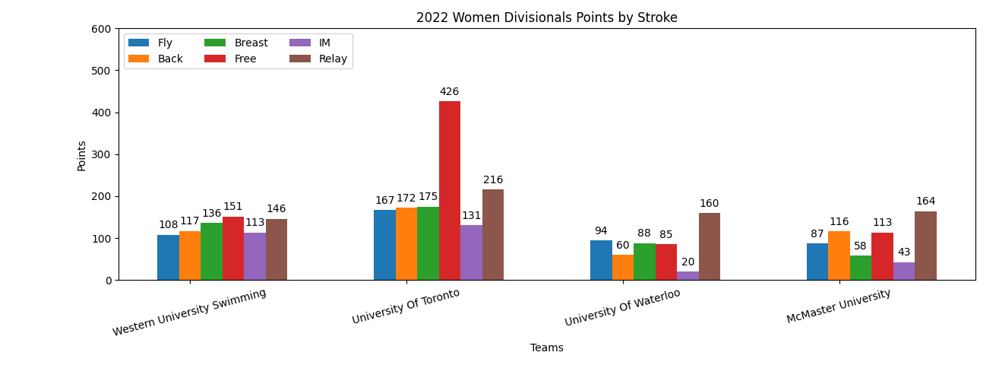
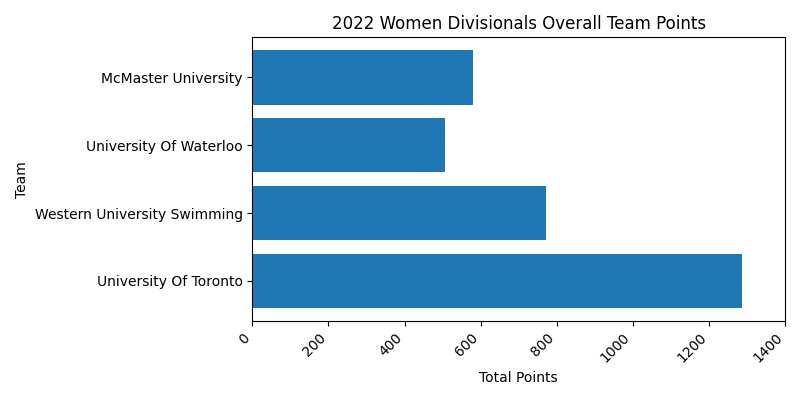
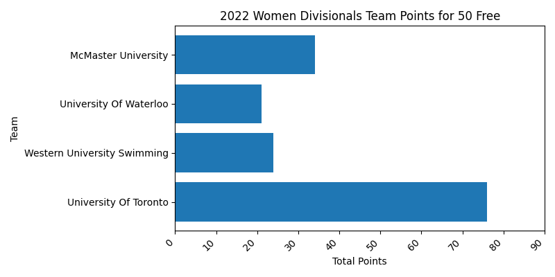
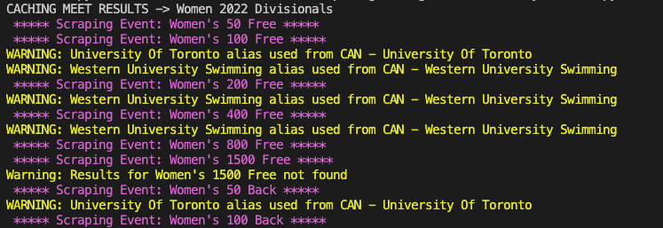

# Python Web Scraper for Swimming Results

## Description
I developed this web scraper with the goal to get insights on swim meet point 
results. For those not familiar with swimming, championship swim meets generally 
award points for each event, in decreasing order from 1st to whatever place is 
determined to be the last point's scoring place. All of the online results currently available only show the overall points scored for the whole meet. I 
wanted to be able to dive deeper into the data and give a representation of 
points per swim stroke, or even by individual event. 

My first thought was to find an API from which I could fetch the results. 
However, there were no open source APIs available, so I decided to use 
swimrankings.net to get the data. By providing the meet id for the meet on 
swimrankings.net, I was able to scrape the site to get the results for every 
event in the meet using Beautifulsoup. I organized these results in json format 
and cached them so they would not have to be fetched again. I then used 
Matplotlib to plot the results in the following ways:
- Overall points for the whole meet.
- Points by stroke.
- Points by event.

Some future improvements I would like to make, would be to allow for easier 
selection of meets and teams. Currently, the user must know the meet id and the
exact team names if they are looking to filter teams. In addition to this, I 
would like to improve my matplotlib skills and make displays that show even 
more valuable information like athlete progress and other point breakdowns. Finally, I would like to add a UI to the project to make it easier to use and 
get the required data. 


## Usage
1. Declare a new instance of Meet class.
* name and year are for your reference
* meet_id can be found on swimrankings.net: 
* points_system can be defined in config file
* relay_mult varies with meet rules
* gender male = 1, female = 2

```
usports = Meet(name="USports", year="2023", meet_id="636410", points_system=config.usports_points, relay_mult=1, gender=1)
```

2. Choose the meet you want to display:
```
meet = oua2023

meet_results = meet.get_meet_results()
meet_name = meet.name
meet_gender = config.gender[meet.gender]
meet_year = meet.year
meet_title = f'{meet_year} {meet_gender} {meet_name}'
```

3. Plot meet using any of the three Plotter methods:
* Overall points
* Points by stroke
* Points by event 
```
plot = Plotter()
plot.plot_points_by_stroke(
    name=meet_title,
    results=meet_results["results"], 
    points=meet_results["points"], 
    teams=[
        'University Of Toronto', 
        'Western University Swimming', 
        'University Of Waterloo', 
        'McMaster University'
    ])
plot.plot_meet_points(name=meet_title, points=meet_results["points"])
plot.plot_event_points(
    name=meet_title, 
    event="200 Fly", 
    results=meet_results["results"]["200 Fly"]["points"])
```
## Gallery
 
 
 
 
 
 
 


